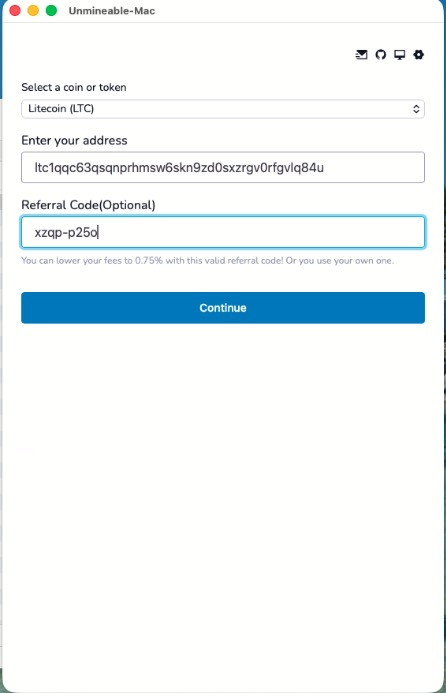
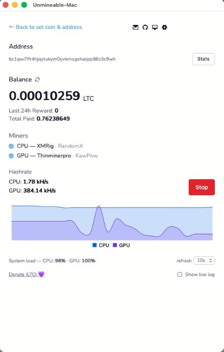
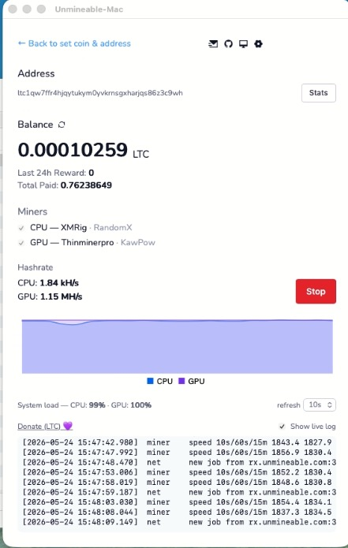
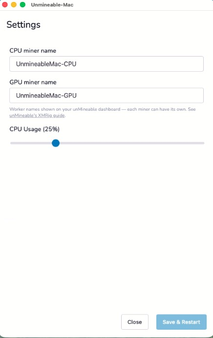

# Unmineable-Mac

> 🛠️ A maintained fork of [2nthony/macmineable](https://github.com/2nthony/macmineable).
> The original author stopped developing it after switching to an M1 Mac
> ("can not connect to unmineable server"). This fork revives it: upgraded
> XMRig, a selectable GPU miner, faster hashrate readout, and a cleaner UI.

_macOS 11 or above_

## Introduction

Unmineable-Mac is a 3rd-party [unMineable](https://unmineable.com) client for
macOS — it lets you mine cryptocurrency on your Mac through a simple UI. It is
not affiliated with unMineable.

## Screenshots

<p>
  
  
  
  
</p>

## Highlights

- [x] unMineable-flavoured UI, written in Go and Svelte
- [x] **Selectable CPU and GPU miners** — switch with one toggle
- [x] XMRig `6.26.0` for CPU mining (RandomX)
- [x] Thinminerpro for GPU mining (KawPow / Metal) on Apple Silicon
- [x] Dark mode
- [x] All unMineable coins supported
- [x] Tweak CPU usage for mining
- [x] Live hashrate, balance, and an optional in-app log panel
- [x] Form memory and update check

## Miners

Unmineable-Mac can mine with either backend — or **both at the same time** —
using the CPU / GPU checkboxes on the mining screen:

| Backend | Type | Algorithm | unMineable pool | Requires |
| --- | --- | --- | --- | --- |
| [XMRig](https://github.com/xmrig/xmrig) `6.26.0` | CPU | RandomX | `rx.unmineable.com` | Any Mac |
| [Thinminerpro](https://github.com/rezahussain/thinminerpro) | GPU (Metal) | KawPow | `kp.unmineable.com` | **Apple Silicon** |

RandomX is CPU-only by design, so GPU mining uses a different algorithm
(KawPow) via Thinminerpro, which runs on the GPU through Metal.

> ⚠️ **GPU mining requires an Apple Silicon Mac (M-series).** Thinminerpro is
> a Metal miner; on Intel Macs the GPU option is disabled and only the CPU
> miner (XMRig) is available.

> ⚠️ Mining on a Mac is generally not profitable and runs the chips hot. Treat
> this as something to experiment with on hardware you already own.

### Fetching the miner binaries

The miner binaries are **not** committed to this repo. Fetch them before
building:

```sh
npm run fetch:miners
```

This downloads XMRig (`6.26.0`, Intel + Apple Silicon) and Thinminerpro into
`assets/miner/`.

## Build from source

```sh
npm install
npm run fetch:miners   # download miner binaries into assets/miner/
npm run build:app      # build the Svelte UI + Go app into out/
```

The built `Unmineable-Mac.app` lands in `out/`.

## What changed in this fork

- Upgraded XMRig `6.17.0` → `6.26.0` — the stale build was the cause of the
  original "can not connect" failure on Apple Silicon
- Added a **CPU / GPU miner toggle** on the mining screen
- Added **Thinminerpro** (GPU / KawPow via Metal) for Apple Silicon
- Faster hashrate updates — XMRig reports every 5s, and a GPU hashrate is
  derived from Thinminerpro's output
- Bigger, **resizable** window with an optional inline **live-log panel**
- Miner `stderr` is surfaced in the logs so launch failures are visible
- Replaced "Buy Me a Coffee" with a **Donate** button (Litecoin)
- Removed the promotion banner and sponsor sections
- Rebranded to **Unmineable-Mac**

## Notices

The app runs a local webserver on `127.0.0.1:47261` to render the UI — make
sure that host/port is free.

Press **Stop** before quitting while mining, so the miner process is shut
down cleanly.

Miner binaries are unsigned third-party software; `fetchMiners.sh` clears the
macOS quarantine flag, but Gatekeeper may still prompt on first launch — allow
them in System Settings if needed.

## LICENSE

GNU GPL v3. Originally © [2nthony](https://github.com/2nthony); this fork is
maintained by [shiftingeden](https://github.com/shiftingeden).

As a derivative of GPL-v3 software, this fork **must** remain under GPL v3 —
that is a requirement of the license, so the `LICENSE` file stays in place.
